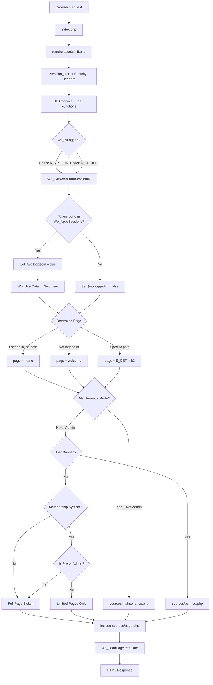

# triBBBal Authentication & Authorization — Full Process Guide

> **Purpose:** This document describes the complete user authentication and authorization flow used in triBBBal, from bootstrap to page rendering. It is written so a new project with the same `Wo_Users` table schema can reimplement authentication from scratch.

---

## Table of Contents

1. [Database Prerequisites](#1-database-prerequisites)
2. [Bootstrap Chain](#2-bootstrap-chain)
3. [Session & Cookie Initialization](#3-session--cookie-initialization)
4. [Checking If a User Is Logged In](#4-checking-if-a-user-is-logged-in)
5. [The `$wo` Global — Auth State Container](#5-the-wo-global--auth-state-container)
6. [Login Flow (Credential Verification)](#6-login-flow-credential-verification)
7. [Session Token Creation](#7-session-token-creation)
8. [Post-Login Security Checks](#8-post-login-security-checks)
9. [Registration Flow](#9-registration-flow)
10. [Page Routing Based on Auth State](#10-page-routing-based-on-auth-state)
11. [Authorization Layers](#11-authorization-layers)
12. [Logout Flow](#12-logout-flow)
13. [Password Reset Flow](#13-password-reset-flow)
14. [Key Functions Reference](#14-key-functions-reference)
15. [Reimplementation Checklist](#15-reimplementation-checklist)

---

## 1. Database Prerequisites

### `Wo_Users` Table — Auth-Relevant Columns

| Column | Type | Purpose |
|--------|------|---------|
| `user_id` | INT (PK, AUTO_INCREMENT) | Unique user identifier |
| `username` | VARCHAR | Unique username for login |
| `email` | VARCHAR | Email address for login |
| `phone_number` | VARCHAR | Phone number for login |
| `password` | VARCHAR(255) | Hashed password (`password_hash()`, legacy md5/sha1) |
| `active` | TINYINT | `0` = pending email verify, `1` = active, `2` = deactivated by admin |
| `admin` | TINYINT | `0` = normal, `1` = admin, `2` = moderator |
| `banned` | TINYINT | `1` = banned user |
| `is_pro` | TINYINT | `0` = free, non-zero = premium tier |
| `pro_type` | INT | Premium package type |
| `status` | TINYINT | `1` = invisible/offline mode |
| `two_factor` | TINYINT | `1` = two-factor auth enabled |
| `two_factor_verified` | TINYINT | `1` = 2FA setup confirmed |
| `two_factor_method` | VARCHAR | `two_factor`, `google`, `authy` |
| `two_factor_hash` | VARCHAR | Temporary hash for 2FA verification |
| `email_code` | VARCHAR | Verification/reset code (md5 hashed) |
| `sms_code` | VARCHAR | SMS verification code |
| `time_code_sent` | INT | Unix timestamp — code expiry check |
| `ip_address` | VARCHAR | Last known IP |
| `last_login_data` | TEXT (JSON) | Last login geolocation data |
| `lastseen` | INT | Unix timestamp of last activity |
| `start_up` | TINYINT | `0` = completed onboarding |
| `language` | VARCHAR | User's preferred language |
| `first_name` | VARCHAR | Display name (first) |
| `last_name` | VARCHAR | Display name (last) |
| `avatar` | VARCHAR | Profile picture path |
| `cover` | VARCHAR | Cover photo path |
| `verified` | TINYINT | `1` = verified account |
| `showlastseen` | TINYINT | `0` = hide last seen |

### `Wo_AppsSessions` Table

| Column | Type | Purpose |
|--------|------|---------|
| `id` | INT (PK) | Row identifier |
| `user_id` | INT | FK to `Wo_Users.user_id` |
| `session_id` | VARCHAR(255) | Random session token (SHA1+MD5+rand) |
| `platform` | VARCHAR | `web`, `phone`, `api` |
| `platform_details` | TEXT (JSON) | Browser/device user-agent data |
| `time` | INT | Unix timestamp of session creation |

### `Wo_Bad_Login` Table

| Column | Type | Purpose |
|--------|------|---------|
| `id` | INT (PK) | Row identifier |
| `ip` | VARCHAR | IP address of failed attempt |
| `time` | INT | Timestamp of failed attempt |

### `Wo_Config` Table

| Key | Purpose |
|-----|---------|
| `prevent_system` | `1` = enable brute-force login prevention |
| `login_auth` | `1` = verify IP geolocation on login |
| `two_factor` | `1` = enable SMS/email 2FA |
| `google_authenticator` | `1` = enable Google Authenticator |
| `authy_settings` | `1` = enable Authy |
| `two_factor_type` | `email`, `phone`, or `both` |
| `membership_system` | `1` = require pro membership for most features |
| `user_registration` | `0` = disable public registration |
| `maintenance_mode` | `1` = site in maintenance |
| `remember_device` | `1` = allow "remember me" cookie |

---

## 2. Bootstrap Chain

Every request begins at `index.php` and follows this chain:

```
Browser → Apache (.htaccess rewrite) → index.php
                                            │
                                            ▼
                                   require('assets/init.php')
                                            │
          ┌─────────────────────────────────┼──────────────────────────┐
          ▼                                 ▼                          ▼
   config.php                     session_start()              Security headers
   (DB creds, site_url)     (cookie_httponly, use_only_cookies)  (X-FRAME-OPTIONS)
          │
          ▼
   DB Connection ($sqlConnect, $db)
          │
          ▼
   Include function libraries:
     - functions_general.php  (Wo_IsLogged, Wo_Secure, helpers)
     - tabels.php             (T_ table constants)
     - functions_one.php      (Wo_Login, Wo_UserData, Wo_CreateLoginSession, etc.)
     - functions_two.php      (extended functions)
     - functions_three.php    (Wo_TwoFactor, Wo_VerfiyIP, etc.)
          │
          ▼
   $wo global populated:
     - $wo['config']   ← all settings from Wo_Config table
     - $wo['loggedin'] ← result of Wo_IsLogged()
     - $wo['user']     ← Wo_UserData() if logged in
```

### Security Headers Set by `init.php`

```php
@ini_set('session.cookie_httponly', 1);      // Prevent JS access to session cookie
@ini_set('session.use_only_cookies', 1);     // No session ID in URLs
@header("X-FRAME-OPTIONS: SAMEORIGIN");      // Clickjacking protection
@header("Content-Security-Policy-Report-Only: ...");  // CSP reporting
```

---

## 3. Session & Cookie Initialization

```php
session_start();
```

PHP's native session is used. The session stores a custom token (`$_SESSION['user_id']`), which is **not** the actual `user_id` integer — it is a random `session_id` string from the `Wo_AppsSessions` table that maps to a user.

A persistent cookie named `user_id` can also store the same session token for "remember me" functionality.

---

## 4. Checking If a User Is Logged In

### `Wo_IsLogged()` — The Gate Function

```php
function Wo_IsLogged() {
    // Check session first
    if (isset($_SESSION['user_id']) && !empty($_SESSION['user_id'])) {
        $id = Wo_GetUserFromSessionID($_SESSION['user_id']);
        if (is_numeric($id) && !empty($id)) {
            return true;
        }
    }
    // Fall back to persistent cookie
    else if (!empty($_COOKIE['user_id'])) {
        $id = Wo_GetUserFromSessionID($_COOKIE['user_id']);
        if (is_numeric($id) && !empty($id)) {
            return true;
        }
    }
    return false;
}
```

**How it works:**

1. Checks `$_SESSION['user_id']` for a session token string
2. If not found, checks `$_COOKIE['user_id']` for a persistent token
3. Looks up the token in `Wo_AppsSessions` table via `Wo_GetUserFromSessionID()`
4. If a valid `user_id` is returned from the sessions table, the user is logged in

### `Wo_GetUserFromSessionID()` — Token-to-User Resolution

```php
function Wo_GetUserFromSessionID($session_id, $platform = 'web') {
    global $sqlConnect, $db;
    if (empty($session_id)) {
        return false;
    }
    $session_id = Wo_Secure($session_id);
    $query = mysqli_query($sqlConnect,
        "SELECT * FROM Wo_AppsSessions
         WHERE session_id = '{$session_id}' LIMIT 1"
    );
    if (mysqli_num_rows($query)) {
        $fetched_data = mysqli_fetch_assoc($query);
        // Update platform details if missing
        if (empty($fetched_data['platform_details']) && $fetched_data['platform'] == 'web') {
            $ua = json_encode(getBrowser());
            $db->where('id', $fetched_data['id'])
               ->update(T_APP_SESSIONS, ['platform_details' => $ua]);
        }
        return $fetched_data['user_id'];  // Returns the integer user_id
    }
    return false;
}
```

**Key point:** The session token stored in `$_SESSION['user_id']` / `$_COOKIE['user_id']` is a long random hash, **not** the user's numeric ID. This hash is looked up in `Wo_AppsSessions` to resolve the actual `user_id`.

---

## 5. The `$wo` Global — Auth State Container

After `init.php` runs, the `$wo` global array is populated and available everywhere:

```php
// Auth state
$wo['loggedin']              // bool — true if user authenticated
$wo['user']                  // array — full user record if logged in
$wo['user']['user_id']       // int — user's numeric ID
$wo['user']['username']      // string — unique username
$wo['user']['name']          // string — display name (first + last)
$wo['user']['admin']         // int — 0=user, 1=admin, 2=moderator
$wo['user']['banned']        // int — 1 if banned
$wo['user']['is_pro']        // int — 0=free, >0=premium
$wo['user']['active']        // int — 1=active
$wo['user']['status']        // int — 1=invisible

// Site config (from DB, loaded every request)
$wo['config']['site_url']
$wo['config']['membership_system']
$wo['config']['maintenance_mode']
// ...200+ other settings
```

### How `$wo['user']` Is Populated

When `Wo_IsLogged()` returns `true`, the bootstrap code calls `Wo_UserData($user_id)` to load the full user record:

```php
function Wo_UserData($user_id, $password = true) {
    global $wo, $sqlConnect, $cache, $db;

    // 1. Sanitize input
    $user_id = Wo_Secure($user_id);

    // 2. Check file-based cache first (if cache enabled)
    if ($wo['config']['cacheSystem'] == 1) {
        $fetched_data = cache($user_id, 'users', 'read');
        if (!empty($fetched_data)) {
            return $fetched_data;
        }
    }

    // 3. Query database
    $sql = mysqli_query($sqlConnect,
        "SELECT * FROM Wo_Users WHERE user_id = '{$user_id}'"
    );
    $fetched_data = mysqli_fetch_assoc($sql);

    // 4. Enrich data (avatar URLs, verification status, online status, etc.)
    $fetched_data['id']   = $fetched_data['user_id'];
    $fetched_data['type'] = 'user';
    $fetched_data['url']  = Wo_SeoLink('index.php?link1=timeline&u=' . $fetched_data['username']);
    $fetched_data['name'] = $fetched_data['first_name'] . ' ' . $fetched_data['last_name'];

    // 5. Cache the enriched result
    if ($generateCache) {
        cache($user_id, 'users', 'write', $fetched_data);
    }

    return $fetched_data;
}
```

---

## 6. Login Flow (Credential Verification)

Login happens via an AJAX POST to `requests.php?f=login`, dispatched to `xhr/login.php`.

### Step-by-Step Flow

```
User submits form → jQuery AJAX POST → requests.php?f=login → xhr/login.php
```

### `Wo_Login()` — Credential Verification

```php
function Wo_Login($username, $password) {
    global $sqlConnect;
    if (empty($username) || empty($password)) {
        return false;
    }

    $username = Wo_Secure($username);

    // 1. Look up user by username, email, OR phone number
    $query = mysqli_query($sqlConnect,
        "SELECT * FROM Wo_Users
         WHERE username = '{$username}'
            OR email = '{$username}'
            OR phone_number = '{$username}'"
    );

    if (mysqli_num_rows($query)) {
        $user = mysqli_fetch_assoc($query);

        // 2. Detect password hash type
        if (preg_match('/^[a-f0-9]{32}$/', $user['password'])) {
            $hash = 'md5';       // Legacy md5 hash
        } else if (preg_match('/^[0-9a-f]{40}$/i', $user['password'])) {
            $hash = 'sha1';      // Legacy sha1 hash
        } else if (strlen($user['password']) == 60) {
            $hash = 'password_hash';  // Modern bcrypt
        }

        // 3. Verify password
        if ($hash == 'password_hash') {
            if (password_verify($password, $user['password'])) {
                return true;
            }
        } else {
            // Legacy hash comparison
            $login_password = Wo_Secure($hash($password));
            $query = mysqli_query($sqlConnect,
                "SELECT COUNT(user_id) FROM Wo_Users
                 WHERE (username='{$username}' OR email='{$username}'
                        OR phone_number='{$username}')
                   AND password='{$login_password}'"
            );
            if (Wo_Sql_Result($query, 0) == 1) {
                // 4. Auto-upgrade legacy hash to bcrypt
                if ($hash == 'sha1' || $hash == 'md5') {
                    $new_password = Wo_Secure(
                        password_hash($password, PASSWORD_DEFAULT)
                    );
                    mysqli_query($sqlConnect,
                        "UPDATE Wo_Users SET password = '$new_password'
                         WHERE username='{$username}' OR email='{$username}'
                                OR phone_number='{$username}'"
                    );
                    cache($user['password'], 'users', 'delete');
                }
                return true;
            }
        }
    }
    return false;
}
```

**Key design decisions:**

- **Multi-identifier login:** Users can log in with username, email, or phone number
- **Backward-compatible hashing:** Supports legacy md5/sha1 and auto-upgrades to bcrypt on successful login
- **Modern hash:** Uses `password_hash()` with `PASSWORD_DEFAULT` (bcrypt) for new passwords
- **Input sanitization:** All inputs pass through `Wo_Secure()` which escapes via `mysqli_real_escape_string` and applies `htmlspecialchars`

---

## 7. Session Token Creation

After `Wo_Login()` returns `true`, the XHR handler creates a session:

### `Wo_CreateLoginSession()` — Generate Session Token

```php
function Wo_CreateLoginSession($user_id) {
    global $sqlConnect, $db;

    // 1. Generate a unique random session hash
    $hash = sha1(rand(111111111, 999999999))
          . md5(microtime())
          . rand(11111111, 99999999)
          . md5(rand(5555, 9999));

    // 2. Delete any collision (extremely unlikely)
    mysqli_query($sqlConnect,
        "DELETE FROM Wo_AppsSessions WHERE session_id = '{$hash}'"
    );

    // 3. Remove existing web session for same user + browser
    $ua = json_encode(getBrowser());
    $db->where('user_id', $user_id)
       ->where('platform_details', $ua)
       ->delete(T_APP_SESSIONS);

    // 4. Insert new session record
    mysqli_query($sqlConnect,
        "INSERT INTO Wo_AppsSessions
         (user_id, session_id, platform, platform_details, time)
         VALUES('{$user_id}', '{$hash}', 'web', '$ua', " . time() . ")"
    );

    return $hash;  // This hash is stored in $_SESSION and/or cookie
}
```

### XHR Login Handler — Full Orchestration (`xhr/login.php`)

```php
// 1. Clear any existing session/cookie
if (!empty($_SESSION['user_id'])) {
    unset($_SESSION['user_id']);
}
if (!empty($_COOKIE['user_id'])) {
    setcookie('user_id', '', -1, '/');
}

// 2. Brute-force protection (if enabled)
if ($wo['config']['prevent_system'] == 1) {
    if (!WoCanLogin()) {
        // Return error: "Too many login attempts"
        exit();
    }
}

// 3. Verify credentials
$result = Wo_Login($username, $password);

if ($result === false) {
    // Wrong username/password
    // Log bad attempt if prevent_system enabled
    WoAddBadLoginLog();
}

// 4. Check if account is disabled by admin
else if (Wo_UserInactive($username)) {
    // "Account disabled, contact admin"
}

// 5. Check if login is from unusual IP (geolocation verification)
else if (Wo_VerfiyIP($username) === false) {
    // Sends verification code via email
    // Redirect to /unusual-login
}

// 6. Check if two-factor authentication is required
else if (Wo_TwoFactor($username) === false) {
    // Sends 2FA code via email/SMS/authenticator
    // Redirect to /unusual-login?type=two-factor
}

// 7. Check if email activation is pending
else if (Wo_UserActive($username) === false) {
    // Redirect to /user-activation
}

// 8. All checks passed — create session
else {
    $userid = Wo_UserIdForLogin($username);

    // Update last known IP
    $ip = Wo_Secure(get_ip_address());
    mysqli_query($sqlConnect,
        "UPDATE Wo_Users SET ip_address = '{$ip}' WHERE user_id = '{$userid}'"
    );
    cache($userid, 'users', 'delete');

    // Create session token
    $session = Wo_CreateLoginSession($userid);
    $_SESSION['user_id'] = $session;

    // Set persistent cookie if "remember me" checked
    if ($wo['config']['remember_device'] == 1
        && !empty($_POST['remember_device'])
        && $_POST['remember_device'] == 'on') {
        setcookie("user_id", $session,
            time() + (10 * 365 * 24 * 60 * 60),
            '/', '.' . preg_replace("/^(.*\.)?([^.]*\..*)$/", "$2", $_SERVER['HTTP_HOST'])
        );
    }

    // Redirect to homepage or membership page
    $data = ['status' => 200, 'location' => $wo['config']['site_url']];

    // If membership system is enabled and user is not pro, redirect to upgrade page
    if ($wo['config']['membership_system'] == 1) {
        $user_data = Wo_UserData($userid);
        if ($user_data['is_pro'] == 0) {
            $data['location'] = Wo_SeoLink('index.php?link1=go-pro');
        }
    }
}
```

---

## 8. Post-Login Security Checks

### Brute-Force Prevention

When `$wo['config']['prevent_system'] == 1`:

- `WoCanLogin()` — Checks `Wo_Bad_Login` table for recent failed attempts from the same IP
- `WoAddBadLoginLog()` — Records a failed login attempt with IP and timestamp
- `Wo_DeleteBadLogins()` — Clears old records on successful login

### IP Geolocation Verification (`Wo_VerfiyIP`)

When `$wo['config']['login_auth'] == 1`:

1. Gets user's current IP via `get_ip_address()`
2. Queries `ip-api.com` for geolocation (region, country, timezone, city)
3. Compares against `last_login_data` stored in user record
4. If location differs: sends email with verification code, redirects to `/unusual-login`
5. On first login: stores geolocation data, allows access

### Two-Factor Authentication (`Wo_TwoFactor`)

When 2FA is enabled globally AND for the user:

1. Generates a random 6-digit code: `rand(111111, 999999)`
2. Stores MD5 hash of code in `email_code` column
3. Sends code via SMS and/or email based on `two_factor_type` config
4. Redirects to `/unusual-login?type=two-factor`
5. User enters code → verified against stored hash

Supports three methods:
- `two_factor` — Email/SMS code
- `google` — Google Authenticator (TOTP)
- `authy` — Authy app

---

## 9. Registration Flow

Registration is handled by `xhr/register.php` calling `Wo_RegisterUser()`:

```php
function Wo_RegisterUser($registration_data, $invited = false) {
    global $wo, $sqlConnect;

    // 1. Check if registration is enabled
    if ($wo['config']['user_registration'] == 0 && !$invited) {
        return false;
    }

    // 2. Capture IP address
    $ip = get_ip_address();

    // 3. If geolocation auth is enabled, store initial login data
    if ($wo['config']['login_auth'] == 1) {
        $getIpInfo = fetchDataFromURL("http://ip-api.com/json/$ip");
        $getIpInfo = json_decode($getIpInfo, true);
        if ($getIpInfo['status'] == 'success') {
            $registration_data['last_login_data'] = json_encode($getIpInfo);
        }
    }

    // 4. Set metadata
    $registration_data['registered'] = date('n') . '/' . date("Y");
    $registration_data['joined']     = time();
    $registration_data['ip_address'] = Wo_Secure($ip);
    $registration_data['language']   = $wo['config']['defualtLang'];

    // 5. Hash password with bcrypt
    $registration_data['password'] = Wo_Secure(
        password_hash($registration_data['password'], PASSWORD_DEFAULT)
    );

    // 6. Insert into Wo_Users
    $fields = '`' . implode('`,`', array_keys($registration_data)) . '`';
    $data   = '\'' . implode('\', \'', $registration_data) . '\'';
    $query  = mysqli_query($sqlConnect,
        "INSERT INTO Wo_Users ({$fields}) VALUES ({$data})"
    );
    $user_id = mysqli_insert_id($sqlConnect);

    // 7. Create user fields record
    mysqli_query($sqlConnect,
        "INSERT INTO Wo_UserFields (user_id) VALUES ({$user_id})"
    );

    return true;
}
```

After registration, depending on config:
- **Email verification required:** User gets activation email with code, redirected to `/user-activation`
- **Auto-login:** `Wo_SetLoginWithSession()` is called to create a session immediately

### `Wo_SetLoginWithSession()` — Auto-Login After Registration

```php
function Wo_SetLoginWithSession($user_email) {
    $user_email = Wo_Secure($user_email);
    $_SESSION['user_id'] = Wo_CreateLoginSession(
        Wo_UserIdFromEmail($user_email)
    );
    setcookie("user_id", $_SESSION['user_id'],
        time() + (10 * 365 * 24 * 60 * 60)
    );
}
```

---

## 10. Page Routing Based on Auth State

`index.php` determines which page to render based on `$wo['loggedin']`:

### Step 1: Determine the Page Slug

```php
$page = '';

// Logged in + no specific page → home feed
if ($wo['loggedin'] == true && !isset($_GET['link1'])) {
    $page = 'home';
}
// Specific page requested
elseif (isset($_GET['link1'])) {
    $page = $_GET['link1'];
}

// Not logged in + no page / home → welcome (login/register page)
if ((!isset($_GET['link1']) && $wo['loggedin'] == false)
    || (isset($_GET['link1']) && $wo['loggedin'] == false && $page == 'home')) {
    $page = 'welcome';
}
```

### Step 2: Maintenance Mode Check

```php
if ($wo['config']['maintenance_mode'] == 1) {
    if ($wo['loggedin'] == false) {
        $page = 'maintenance';  // Show maintenance page
    } else {
        if (Wo_IsAdmin() === false) {
            $page = 'maintenance';  // Non-admins see maintenance
        }
        // Admins can still access the site
    }
}
```

### Step 3: Route Through Auth Tiers

The page switch has **four nested tiers**:

```
Tier 1: Is the user banned?
  └─ YES → Show banned page (only logout, contact, and commission pages accessible)
  └─ NO → Continue

Tier 2: Is the membership system enabled?
  └─ YES → Is the user logged in?
    └─ YES → Is the user a pro member or admin?
      └─ YES → Full access (all pages available via giant switch/case)
      └─ NO → Limited access (only settings, wallet, go-pro, welcome, logout)
    └─ NO → Guest pages only (welcome, login, register, forgot-password, etc.)
  └─ NO → Continue to Tier 3

Tier 3: Is the user logged in?
  └─ YES → Full access to all pages
  └─ NO → Guest-only pages (welcome, register, reset password, public pages)

Tier 4: Fallback
  └─ If $wo['content'] is empty after routing:
    - Membership enabled + logged in → go-pro page
    - Otherwise → 404 page
```

### Route Classification

**Always accessible (any auth state):**
- `welcome` — Login/register page
- `register` — Registration
- `forgot-password`, `reset-password` — Password recovery
- `activate`, `user-activation` — Account activation
- `contact-us` — Contact form
- `terms`, `site-pages` — Legal pages
- `logout` — Session destruction
- `404`, `oops` — Error pages
- `unusual-login` — 2FA / IP verification

**Requires login:**
- `home` — News feed
- `timeline` — User profile
- `messages` — Chat
- `setting` — User settings
- `search`, `explore` — Discovery
- All social features (groups, pages, events, etc.)

**Requires login + pro membership (when membership system on):**
- All the above except `setting`, `wallet`, `go-pro`

**Admin-only:**
- `admincp`, `admin-cp` — Admin control panel (handled by separate `admincp.php`)

---

## 11. Authorization Layers

### `Wo_IsAdmin()` — Admin Check

```php
function Wo_IsAdmin($user_id = 0) {
    global $wo, $sqlConnect;
    if ($wo['loggedin'] == false) {
        return false;
    }
    // Check specific user
    if (!empty($user_id) && $user_id > 0) {
        $query = mysqli_query($sqlConnect,
            "SELECT COUNT(user_id) as count FROM Wo_Users
             WHERE admin = '1' AND user_id = {$user_id}"
        );
        $sql = mysqli_fetch_assoc($query);
        return ($sql['count'] > 0);
    }
    // Check current user
    return ($wo['user']['admin'] == 1);
}
```

### `Wo_IsModerator()` — Moderator Check

Same pattern as `Wo_IsAdmin()` but checks `admin = '2'`.

### Account Status Checks

```php
// Is the account disabled by admin?
function Wo_UserInactive($username) {
    // Checks: active = '2'
}

// Is the account active (email verified)?
function Wo_UserActive($username) {
    // Checks: active = '1'
}

// Has the user completed onboarding?
function Wo_IsUserComplete($user_id) {
    // Checks: start_up = '0'
}
```

### Authorization Pattern Used in XHR Handlers

Every AJAX handler in `xhr/` follows this guard pattern:

```php
if ($f == 'some_action') {
    if ($wo['loggedin'] == false) {
        // Return error or empty response
        exit();
    }

    // For admin-only actions:
    if (Wo_IsAdmin() === false) {
        exit();
    }

    // Proceed with authorized action...
}
```

### Authorization in Page Controllers (`sources/`)

```php
// sources/setting.php
if ($wo['loggedin'] == false) {
    header("Location: " . Wo_SeoLink('index.php?link1=welcome'));
    exit();
}
// ... render settings page
```

---

## 12. Logout Flow

Handled by `sources/logout.php`:

```php
// 1. Unset all session variables
session_unset();

// 2. Delete session record from DB
if (!empty($_SESSION['user_id'])) {
    mysqli_query($sqlConnect,
        "DELETE FROM Wo_AppsSessions
         WHERE session_id = '" . Wo_Secure($_SESSION['user_id']) . "'"
    );
}

// 3. Destroy PHP session
session_destroy();

// 4. Clear persistent cookie + delete DB record
if (isset($_COOKIE['user_id'])) {
    mysqli_query($sqlConnect,
        "DELETE FROM Wo_AppsSessions
         WHERE session_id = '" . Wo_Secure($_COOKIE['user_id']) . "'"
    );
    setcookie('user_id', null, -1, '/');
}

// 5. Clear other session cookies
setcookie('chat_session', null, -1, '/');
setcookie('chattab_minimized', null, -1, '/');
unset($_SESSION['peer_uniq_id']);
unset($_SESSION['peer_useragent']);

// 6. Redirect to homepage
header("Location: " . $wo['config']['site_url']);
exit();
```

---

## 13. Password Reset Flow

### Initiate Reset

1. User visits `/forgot-password`
2. Enters email address
3. System generates a code: `rand(111111, 999999)`
4. Stores `md5($code)` in `email_code` column, sets `time_code_sent` to `time() + 7200` (2 hour expiry)
5. Sends email with reset link containing: `{user_id}_{email_code}`

### Validate Token

```php
function Wo_isValidPasswordResetToken($string) {
    $string_exp = explode('_', $string);
    $user_id    = $string_exp[0];
    $password   = $string_exp[1];

    // Check user exists, code matches, and hasn't expired
    $query = mysqli_query($sqlConnect,
        "SELECT COUNT(user_id) FROM Wo_Users
         WHERE user_id = '{$user_id}'
           AND email_code = '{$password}'
           AND active = '1'
           AND time_code_sent > '" . time() . "'"
    );
    return (Wo_Sql_Result($query, 0) == 1);
}
```

### Set New Password

```php
function Wo_ResetPassword($user_id, $password) {
    $password = Wo_Secure(
        password_hash($password, PASSWORD_DEFAULT)
    );
    mysqli_query($sqlConnect,
        "UPDATE Wo_Users SET password = '{$password}'
         WHERE user_id = '{$user_id}'"
    );
}
```

---

## 14. Key Functions Reference

| Function | File | Purpose |
|----------|------|---------|
| `Wo_IsLogged()` | functions_general.php | Check if user is authenticated |
| `Wo_GetUserFromSessionID($session_id)` | functions_one.php | Resolve session token → user_id |
| `Wo_Login($username, $password)` | functions_one.php | Verify credentials |
| `Wo_CreateLoginSession($user_id)` | functions_one.php | Generate & store session token |
| `Wo_SetLoginWithSession($email)` | functions_one.php | Auto-login (post-registration) |
| `Wo_UserData($user_id)` | functions_one.php | Load full user record |
| `Wo_UserActive($username)` | functions_one.php | Check if account is active (email verified) |
| `Wo_UserInactive($username)` | functions_one.php | Check if account is admin-disabled |
| `Wo_UserExists($username)` | functions_one.php | Check if username exists |
| `Wo_UserIdForLogin($username)` | functions_one.php | Get user_id from username/email/phone |
| `Wo_UserIdFromEmail($email)` | functions_one.php | Get user_id from email |
| `Wo_UserIdFromUsername($username)` | functions_one.php | Get user_id from username |
| `Wo_RegisterUser($data)` | functions_one.php | Insert new user |
| `Wo_ResetPassword($user_id, $password)` | functions_one.php | Update password hash |
| `Wo_IsAdmin($user_id)` | functions_one.php | Check admin role (admin=1) |
| `Wo_IsModerator($user_id)` | functions_one.php | Check moderator role (admin=2) |
| `Wo_LastSeen($user_id)` | functions_one.php | Update last activity timestamp |
| `Wo_Secure($string)` | functions_general.php | Sanitize input (escape + htmlspecialchars) |
| `Wo_TwoFactor($username)` | functions_three.php | Check & initiate 2FA |
| `Wo_VerfiyIP($username)` | functions_three.php | Geolocation-based login verification |
| `Wo_isValidPasswordResetToken($token)` | functions_one.php | Validate password reset link |
| `Wo_ActivateUser($email, $code)` | functions_one.php | Activate account via email code |
| `Wo_IsUserComplete($user_id)` | functions_one.php | Check if onboarding is complete |

---

## 15. Reimplementation Checklist

To reimplement this auth system in a new project with the same `Wo_Users` schema:

### Database Setup

- [ ] Create `Wo_Users` table with all columns from Section 1
- [ ] Create `Wo_AppsSessions` table for session tokens
- [ ] Create `Wo_Bad_Login` table for brute-force tracking
- [ ] Create `Wo_Config` table with auth-related settings
- [ ] Create `Wo_UserFields` table (created on registration)

### Core Functions to Implement

- [ ] `Wo_Secure($string)` — Input sanitization via `mysqli_real_escape_string` + `htmlspecialchars`
- [ ] `Wo_IsLogged()` — Check `$_SESSION['user_id']` / `$_COOKIE['user_id']` against sessions table
- [ ] `Wo_GetUserFromSessionID($token)` — Look up `Wo_AppsSessions` → return `user_id`
- [ ] `Wo_Login($username, $password)` — Credential verification with multi-hash support
- [ ] `Wo_CreateLoginSession($user_id)` — Generate random hash, insert into `Wo_AppsSessions`
- [ ] `Wo_UserData($user_id)` — Full user record retrieval
- [ ] `Wo_RegisterUser($data)` — Insert user with bcrypt password
- [ ] `Wo_IsAdmin()` / `Wo_IsModerator()` — Role checks
- [ ] `Wo_UserActive()` / `Wo_UserInactive()` — Account status checks
- [ ] `Wo_ResetPassword()` — Password update with bcrypt
- [ ] `Wo_LastSeen($user_id)` — Activity timestamp update

### Bootstrap (`init.php`)

- [ ] Set security headers (`X-FRAME-OPTIONS`, `cookie_httponly`, etc.)
- [ ] Start session
- [ ] Connect to database
- [ ] Load config from `Wo_Config` into `$wo['config']`
- [ ] Call `Wo_IsLogged()` → set `$wo['loggedin']`
- [ ] If logged in: call `Wo_UserData()` → set `$wo['user']`

### Entry Point (`index.php`)

- [ ] Sanitize `$_GET`, `$_POST`, `$_REQUEST` (strip event handlers, tags)
- [ ] Determine page slug from URL
- [ ] Default: logged in → `home`, not logged in → `welcome`
- [ ] Apply maintenance mode gate
- [ ] Apply banned user gate
- [ ] Apply membership system gate (if enabled)
- [ ] Route to correct `sources/{page}.php` controller
- [ ] Render template via `Wo_LoadPage()`

### Login Handler (`xhr/login.php`)

- [ ] Clear existing session/cookies
- [ ] Check brute-force limits
- [ ] Call `Wo_Login()` for credential verification
- [ ] Check account status (inactive, not activated)
- [ ] Check IP geolocation (optional)
- [ ] Check 2FA (optional)
- [ ] Create session token via `Wo_CreateLoginSession()`
- [ ] Store in `$_SESSION['user_id']`
- [ ] Optionally set persistent cookie
- [ ] Return JSON response with redirect URL

### Logout Handler

- [ ] Delete session record from `Wo_AppsSessions`
- [ ] Clear `$_SESSION` and destroy session
- [ ] Clear `user_id` cookie
- [ ] Redirect to site URL

### Security Measures

- [ ] All passwords stored as bcrypt via `password_hash(PASSWORD_DEFAULT)`
- [ ] Auto-upgrade legacy md5/sha1 hashes on login
- [ ] Session tokens are long random hashes (not sequential IDs)
- [ ] Session cookies marked `httponly`
- [ ] Brute-force protection via IP-based attempt logging
- [ ] Optional 2FA (email/SMS/authenticator)
- [ ] Optional IP geolocation verification on new logins
- [ ] Input sanitization on all user inputs (`Wo_Secure()`)
- [ ] `X-FRAME-OPTIONS: SAMEORIGIN` to prevent clickjacking
- [ ] CSP headers (report-only mode)

---

## Flow Diagram


