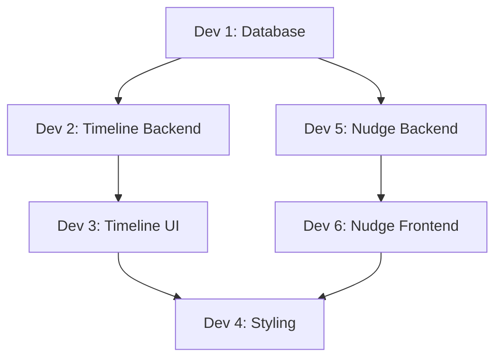

# Team Task Assignment — Timeline Calendar Strip & Nudge System

> **Date:** 2026-07-13  
> **Goal:** Implement two features — (1) Calendar Timeline Strip on user profiles, (2) Nudge system — split across 6 developers with zero file overlap.

---

## Architecture Overview

```
┌──────────────────────────────────────────────────────────────────────┐
│                        REQUEST FLOW                                  │
├──────────────────────────────────────────────────────────────────────┤
│                                                                      │
│  Browser ──► index.php ──► sources/timeline.php                      │
│                   │              │                                   │
│                   │              ├─ require includes/timeline_calendar.php
│                   │              └─ sets $wo['timeline_events']       │
│                   │                       │                           │
│                   │              themes/wondertag/layout/timeline/    │
│                   │                       content.phtml               │
│                   │                       └─ includes nudge-button.phtml
│                   │                                                   │
│                   ├──► sources/nudges.php                             │
│                   │         │                                         │
│                   │         ├─ require includes/nudges.php            │
│                   │         └─ sets $wo['nudges']                     │
│                   │                  │                                │
│                   │         themes/wondertag/layout/nudges/           │
│                   │                  content.phtml                    │
│                   │                                                   │
│  AJAX ──► requests.php ──► xhr/nudge.php                             │
│                                  │                                    │
│                                  └─ require includes/nudges.php      │
│                                                                      │
└──────────────────────────────────────────────────────────────────────┘
```

---

## File Ownership Matrix (No Overlaps)

| Dev   | Role                  | Files Owned (create/edit)                                                                                                    |
| ----- | --------------------- | ---------------------------------------------------------------------------------------------------------------------------- |
| **1** | Database & Migrations | `sql/internship_calendar.sql`                                                                                                |
| **2** | Timeline Backend      | `includes/timeline_calendar.php` _(new)_, `sources/timeline.php`                                                             |
| **3** | Timeline UI           | `themes/wondertag/layout/timeline/content.phtml`                                                                             |
| **4** | All Styling           | `themes/wondertag/css/internship-calendar.css`                                                                               |
| **5** | Nudge Backend         | `includes/nudges.php` _(new)_, `xhr/nudge.php` _(new)_, `sources/nudges.php` _(new)_, `index.php`, `.htaccess` _(root, new)_ |
| **6** | Nudge Frontend        | `themes/wondertag/layout/nudges/content.phtml` _(new)_, `themes/wondertag/layout/timeline/nudge-button.phtml` _(new)_        |

**Rule:** You ONLY edit files listed in your row. If you need something from another dev's file, coordinate via the interface contracts below.

---

## Merge Order & Dependencies



**Merge sequence:**

1. Dev 1 merges first (schema must exist before anything queries it)
2. Dev 2 and Dev 5 can merge in parallel (no dependencies on each other)
3. Dev 3 and Dev 6 merge after their respective backend devs
4. Dev 4 merges last (needs final class names from Dev 3 + Dev 6)

---

---

# Developer 1 — Database & Migrations

## Responsibilities

All schema changes for both features. No PHP. No frontend.

## Tasks

### 1. Add `user_id` and `is_completed` columns to `calendar_events`

```sql
ALTER TABLE calendar_events ADD COLUMN user_id INT DEFAULT NULL AFTER id;
ALTER TABLE calendar_events ADD COLUMN is_completed TINYINT(1) NOT NULL DEFAULT 0 AFTER event_date;
CREATE INDEX idx_calendar_events_user ON calendar_events(user_id);
CREATE INDEX idx_calendar_events_date ON calendar_events(event_date);
```

- `user_id = NULL` means "programme-wide" — visible on every user's timeline
- `user_id = N` means assigned to that specific user only
- `is_completed` explicitly tracks progress instead of relying on past dates

### 2. Create `calendar_nudges` table

```sql
CREATE TABLE calendar_nudges (
    id INT AUTO_INCREMENT PRIMARY KEY,
    sender_id INT NOT NULL,
    receiver_id INT NOT NULL,
    created_at TIMESTAMP DEFAULT CURRENT_TIMESTAMP,
    UNIQUE KEY uq_nudge_pair (sender_id, receiver_id),
    KEY idx_nudge_receiver (receiver_id),
    FOREIGN KEY (sender_id) REFERENCES Wo_Users(user_id),
    FOREIGN KEY (receiver_id) REFERENCES Wo_Users(user_id)
) ENGINE=InnoDB DEFAULT CHARSET=utf8mb4;
```

- The `UNIQUE KEY uq_nudge_pair` enforces one active nudge per sender→receiver direction at a time (prevents duplicates at DB level)

### 3. Update the seed INSERT statements

Update the existing `INSERT INTO calendar_events` to include `user_id` and `is_completed`:

```sql
INSERT INTO calendar_events (user_id, week, day, title, description, event_date, is_completed) VALUES
(NULL, 1, 'Monday',    'Day 1 — Welcome',      'Setup Environment',              '2026-07-06', 1),
(NULL, 1, 'Tuesday',   'Day 2 — PHP Basics',   'Variables, Arrays, Loops',       '2026-07-07', 1),
(NULL, 1, 'Wednesday', 'Day 3 — MySQL Basics',  'SELECT, INSERT, UPDATE, DELETE', '2026-07-08', 0),
(NULL, 1, 'Thursday',  'Day 4 — Advanced PHP',  'Functions, Classes, Namespaces', '2026-07-09', 0),
(NULL, 1, 'Friday',    'Day 5 — Mini Project',  'Build a CRUD app',              '2026-07-10', 0);
```

`NULL` = programme-wide events visible on all timelines.

## Files

```
sql/internship_calendar.sql
```

## Output Contract

After this migration runs, other devs can rely on:

- `calendar_events` has columns: `id, user_id, week, day, title, description, event_date, is_completed`
- `calendar_nudges` has columns: `id, sender_id, receiver_id, created_at`
- The UNIQUE constraint on `(sender_id, receiver_id)` means INSERT will fail on duplicates — backend devs should use `INSERT IGNORE` or check-before-insert

---

---

# Developer 2 — Timeline Backend

## Responsibilities

Retrieve and structure timeline data for the template. No HTML. No CSS. No SQL schema changes.

## Tasks

### 1. Create `includes/timeline_calendar.php`

This is a **new file** (does NOT edit `includes/functions.php`).

```php
<?php
declare(strict_types=1);

/**
 * includes/timeline_calendar.php
 * Helper functions for the Calendar Timeline Strip on user profiles.
 */

/**
 * Wo_GetUserTimelineEvents() — fetches a user's calendar events
 * split into completed, today, and upcoming.
 *
 * @param mysqli $conn
 * @param int $user_id
 * @return array [
 *     'completed' => [...],
 *     'today'     => [...],
 *     'upcoming'  => [...],
 *     'week'      => int,         // current week number
 *     'total_this_week' => int,   // total events in current week
 *     'done_this_week'  => int    // completed events in current week
 * ]
 */
function Wo_GetUserTimelineEvents(mysqli $conn, int $user_id): array
{
    $today = date('Y-m-d');
    $result = [
        'completed' => [],
        'today'     => [],
        'upcoming'  => [],
        'week'      => 1,
        'total_this_week' => 0,
        'done_this_week'  => 0,
    ];

    // Fetch events for this user OR programme-wide (user_id IS NULL)
    $stmt = mysqli_prepare($conn,
        "SELECT id, week, day, title, description, event_date, is_completed
         FROM calendar_events
         WHERE user_id = ? OR user_id IS NULL
         ORDER BY event_date ASC"
    );
    mysqli_stmt_bind_param($stmt, 'i', $user_id);
    mysqli_stmt_execute($stmt);
    $res = mysqli_stmt_get_result($stmt);

    // Determine current week from today's date
    $current_week = 1;
    $upcoming_count = 0;

    while ($row = mysqli_fetch_assoc($res)) {
        $event_date = $row['event_date'];
        $is_completed = (int) $row['is_completed'];

        if ($is_completed === 1) {
            $result['completed'][] = $row;
        } elseif ($event_date === $today) {
            $result['today'][] = $row;
            $current_week = (int) $row['week'];
        } else {
            // Cap upcoming at 5
            if ($upcoming_count < 5) {
                $result['upcoming'][] = $row;
            }
            $upcoming_count++;
        }
    }

    mysqli_stmt_close($stmt);

    // If no today event, infer week from most recent completed
    if (empty($result['today']) && !empty($result['completed'])) {
        $last = end($result['completed']);
        $current_week = (int) $last['week'];
    }

    $result['week'] = $current_week;

    // Count stats for current week
    $stmt2 = mysqli_prepare($conn,
        "SELECT COUNT(*) AS total,
                SUM(CASE WHEN is_completed = 1 THEN 1 ELSE 0 END) AS done
         FROM calendar_events
         WHERE (user_id = ? OR user_id IS NULL)
           AND week = ?"
    );
    mysqli_stmt_bind_param($stmt2, 'ii', $user_id, $current_week);
    mysqli_stmt_execute($stmt2);
    $stats = mysqli_fetch_assoc(mysqli_stmt_get_result($stmt2));
    mysqli_stmt_close($stmt2);

    $result['total_this_week'] = (int) ($stats['total'] ?? 0);
    $result['done_this_week']  = (int) ($stats['done'] ?? 0);

    return $result;
}
```

### 2. Update `sources/timeline.php`

Add two lines after the existing `$wo['user_events']` line (line ~46):

```php
// Calendar Timeline Strip data
require_once __DIR__ . '/../includes/timeline_calendar.php';
$wo['timeline_events'] = Wo_GetUserTimelineEvents($conn, (int) $profile['user_id']);
```

**Exact insertion point** — after this existing line:

```php
$wo['user_events'] = Wo_GetInternshipCalendarEvents($conn, []);
```

Add the two lines above before the `// Render` comment.

## Files

```
includes/timeline_calendar.php  (NEW)
sources/timeline.php            (EDIT — add 2 lines)
```

## Output Contract

After this code runs, the template (`content.phtml`) will have access to:

```php
$wo['timeline_events'] = [
    'completed' => [
        ['id' => 1, 'week' => 1, 'day' => 'Monday', 'title' => 'Day 1 — Welcome', 'description' => 'Setup Environment', 'event_date' => '2026-07-06'],
        ...
    ],
    'today' => [
        ['id' => 4, 'week' => 1, 'day' => 'Thursday', 'title' => 'Day 4 — Advanced PHP', ...],
    ],
    'upcoming' => [
        ['id' => 5, 'week' => 1, 'day' => 'Friday', 'title' => 'Day 5 — Mini Project', ...],
    ],
    'week' => 1,
    'total_this_week' => 5,
    'done_this_week' => 3,
];
```

Dev 3 will consume this structure in the template.

---

---

# Developer 3 — Timeline UI (HTML Only)

## Responsibilities

Insert the Calendar Timeline Strip into the profile page template. No CSS (use class names only — Dev 4 styles them). No backend logic. No SQL.

## Tasks

### 1. Insert Timeline Section

In `themes/wondertag/layout/timeline/content.phtml`, find this block (around line 99–103):

```html
            </nav>
        </section>

        <!-- Filters -->
```

Insert the following **between** `</section>` and `<!-- Filters -->`:

```php
        <!-- ===== CALENDAR TIMELINE STRIP ===== -->
        <section class="tl-section" style="margin: 20px 40px 0 40px;">
            <?php
                $tl = $wo['timeline_events'] ?? [];
                $tl_all = array_merge($tl['completed'] ?? [], $tl['today'] ?? [], $tl['upcoming'] ?? []);
            ?>
            <?php if (!empty($tl_all)): ?>
                <!-- Week Progress Bar -->
                <div class="tl-progress">
                    <div class="tl-progress-label">
                        <span class="tl-progress-week">Week <?php echo (int)($tl['week'] ?? 1); ?></span>
                        <span class="tl-progress-stat"><?php echo (int)($tl['done_this_week'] ?? 0); ?> / <?php echo (int)($tl['total_this_week'] ?? 0); ?> days done</span>
                    </div>
                    <div class="tl-progress-bar">
                        <?php
                            $total = (int)($tl['total_this_week'] ?? 0);
                            $done  = (int)($tl['done_this_week'] ?? 0);
                            $pct   = $total > 0 ? round(($done / $total) * 100) : 0;
                        ?>
                        <div class="tl-progress-fill" style="width: <?php echo $pct; ?>%"></div>
                    </div>
                </div>

                <!-- Timeline Strip -->
                <div class="tl-strip">
                    <?php foreach ($tl['completed'] ?? [] as $ev): ?>
                        <div class="tl-strip-item tl-completed">
                            <div class="tl-strip-dot"><i class="fa-solid fa-check"></i></div>
                            <div class="tl-strip-body">
                                <div class="tl-strip-head">
                                    <h4><?php echo htmlspecialchars($ev['title']); ?></h4>
                                    <span class="tl-strip-date"><?php echo format_date($ev['event_date'], 'D, M j'); ?></span>
                                </div>
                                <p><?php echo htmlspecialchars($ev['description'] ?? ''); ?></p>
                            </div>
                        </div>
                    <?php endforeach; ?>

                    <?php foreach ($tl['today'] ?? [] as $ev): ?>
                        <div class="tl-strip-item tl-today">
                            <div class="tl-strip-dot"><i class="fa-solid fa-circle"></i></div>
                            <div class="tl-strip-body">
                                <div class="tl-strip-head">
                                    <h4><?php echo htmlspecialchars($ev['title']); ?></h4>
                                    <span class="tl-strip-date"><?php echo format_date($ev['event_date'], 'D, M j'); ?></span>
                                </div>
                                <p><?php echo htmlspecialchars($ev['description'] ?? ''); ?></p>
                                <span class="badge-live">Today</span>
                            </div>
                        </div>
                    <?php endforeach; ?>

                    <?php foreach ($tl['upcoming'] ?? [] as $ev): ?>
                        <div class="tl-strip-item tl-upcoming">
                            <div class="tl-strip-dot"><i class="fa-regular fa-circle"></i></div>
                            <div class="tl-strip-body">
                                <div class="tl-strip-head">
                                    <h4><?php echo htmlspecialchars($ev['title']); ?></h4>
                                    <span class="tl-strip-date"><?php echo format_date($ev['event_date'], 'D, M j'); ?></span>
                                </div>
                                <p><?php echo htmlspecialchars($ev['description'] ?? ''); ?></p>
                            </div>
                        </div>
                    <?php endforeach; ?>
                </div>
            <?php else: ?>
                <!-- Empty State -->
                <div class="tl-strip-empty" style="text-align: center; color: var(--muted); padding: 40px;">
                    <i class="fa-solid fa-calendar-xmark" style="font-size: 40px; margin-bottom: 15px; display: block;"></i>
                    <p>No schedule yet.</p>
                </div>
            <?php endif; ?>
        </section>
```

### 2. Include the Nudge Button Partial

In the same file, find the Action Buttons section (around line 88–93):

```html
<!-- ===== ACTION BUTTONS ===== -->
<div class="wow_user_page_btns">
  <button class="btn btn-ghost tag_user_notif">
    <i class="fa-regular fa-bell"></i>
  </button>
  <button class="btn btn-ghost">
    <i class="fa-regular fa-envelope"></i> Message
  </button>
  <button class="btn btn-primary">
    <i class="fa-solid fa-user-plus"></i> Follow
  </button>
  <button class="btn btn-ghost" title="Settings">
    <i class="fa-solid fa-ellipsis"></i>
  </button>
</div>
```

Replace **only** the `<button class="btn btn-ghost" title="Settings">` line with:

```php
                <?php include __DIR__ . '/nudge-button.phtml'; ?>
                <button class="btn btn-ghost" title="Settings"><i class="fa-solid fa-ellipsis"></i></button>
```

This includes the partial that Dev 6 will create. If the file doesn't exist yet during local testing, wrap it:

```php
                <?php if (file_exists(__DIR__ . '/nudge-button.phtml')) include __DIR__ . '/nudge-button.phtml'; ?>
                <button class="btn btn-ghost" title="Settings"><i class="fa-solid fa-ellipsis"></i></button>
```

## Files

```
themes/wondertag/layout/timeline/content.phtml  (EDIT)
```

## Data Contract (What You Consume)

You use `$wo['timeline_events']` which Dev 2 populates. Structure:

| Key               | Type  | Description                        |
| ----------------- | ----- | ---------------------------------- |
| `completed`       | array | Events with `event_date < today`   |
| `today`           | array | Events with `event_date === today` |
| `upcoming`        | array | Max 5 future events                |
| `week`            | int   | Current week number                |
| `total_this_week` | int   | Total events in current week       |
| `done_this_week`  | int   | Completed events in current week   |

Each event array has: `id`, `week`, `day`, `title`, `description`, `event_date`.

## CSS Classes Used (Dev 4 Will Style These)

- `.tl-section`
- `.tl-progress`, `.tl-progress-label`, `.tl-progress-week`, `.tl-progress-stat`, `.tl-progress-bar`, `.tl-progress-fill`
- `.tl-strip`, `.tl-strip-item`, `.tl-strip-dot`, `.tl-strip-body`, `.tl-strip-head`, `.tl-strip-date`
- `.tl-completed`, `.tl-today`, `.tl-upcoming`
- `.tl-strip-empty`
- `.badge-live` (already exists in CSS)

---

---

# Developer 4 — All Styling (Timeline + Nudge CSS)

## Responsibilities

Implement ALL CSS for both features. Only edit the CSS file. No templates. No PHP.

## Tasks

### 1. Timeline Strip Styles — Section 14

Add at the bottom of `themes/wondertag/css/internship-calendar.css`:

```css
/* ---------------------------------------------------------------------
   14. Calendar Timeline Strip (profile page)
   --------------------------------------------------------------------- */

.tl-progress {
  background: var(--surface);
  border: 1px solid var(--hairline);
  border-radius: var(--radius);
  padding: 16px 20px;
  box-shadow: var(--shadow-card);
  margin-bottom: 16px;
}

.tl-progress-label {
  display: flex;
  justify-content: space-between;
  align-items: center;
  margin-bottom: 10px;
}

.tl-progress-week {
  font-family: var(--font-display);
  font-weight: 600;
  font-size: 16px;
  color: var(--ink);
}

.tl-progress-stat {
  font-family: var(--font-mono);
  font-size: 12px;
  color: var(--muted);
}

.tl-progress-bar {
  height: 6px;
  background: var(--hairline);
  border-radius: 3px;
  overflow: hidden;
}

.tl-progress-fill {
  height: 100%;
  background: var(--pine);
  border-radius: 3px;
  transition: width 0.4s ease;
}

/* --- Timeline Strip --- */

.tl-strip {
  position: relative;
  padding-left: 28px;
  margin: 0 0 24px;
}

.tl-strip::before {
  content: "";
  position: absolute;
  left: 9px;
  top: 0;
  bottom: 0;
  width: 2px;
  background: var(--hairline);
}

.tl-strip-item {
  position: relative;
  padding: 12px 0 12px 20px;
}

.tl-strip-dot {
  position: absolute;
  left: -28px;
  top: 14px;
  width: 20px;
  height: 20px;
  border-radius: 50%;
  display: flex;
  align-items: center;
  justify-content: center;
  font-size: 10px;
  z-index: 1;
}

.tl-strip-head {
  display: flex;
  justify-content: space-between;
  align-items: baseline;
}

.tl-strip-head h4 {
  font-family: var(--font-display);
  font-size: 15px;
  font-weight: 600;
  margin: 0;
  color: var(--ink);
}

.tl-strip-date {
  font-family: var(--font-mono);
  font-size: 11px;
  color: var(--muted);
  white-space: nowrap;
}

.tl-strip-body p {
  font-size: 13px;
  color: var(--ink-soft);
  margin: 4px 0 0;
}

/* State: Completed */
.tl-completed .tl-strip-dot {
  background: var(--pine-tint);
  color: var(--pine);
}

.tl-completed .tl-strip-head h4 {
  text-decoration: line-through;
  color: var(--muted);
}

/* State: Today */
.tl-today .tl-strip-dot {
  background: var(--brass);
  color: #fff;
  box-shadow: 0 0 0 4px var(--brass-tint);
}

.tl-today .tl-strip-head h4 {
  color: var(--ink);
  font-weight: 700;
}

/* State: Upcoming */
.tl-upcoming .tl-strip-dot {
  background: var(--surface);
  border: 2px solid var(--hairline);
  color: var(--muted);
}

.tl-upcoming {
  opacity: 0.6;
}

/* --- Empty State --- */
.tl-strip-empty {
  text-align: center;
  color: var(--muted);
  padding: 40px;
}
```

### 2. Nudge Styles — Section 15

```css
/* ---------------------------------------------------------------------
   15. Nudge System
   --------------------------------------------------------------------- */

/* Nudge button (on profile) */
.nudge-btn.nudged {
  color: var(--pine);
  border-color: var(--pine-tint);
  background: var(--pine-tint);
  pointer-events: none;
}

.nudge-btn i {
  margin-right: 4px;
}

/* Nudge Inbox */
.nudge-list {
  display: flex;
  flex-direction: column;
  gap: 0;
}

.nudge-item {
  display: flex;
  align-items: center;
  gap: 14px;
  padding: 16px 20px;
  background: var(--surface);
  border: 1px solid var(--hairline);
  border-radius: var(--radius);
  margin-bottom: 10px;
  box-shadow: var(--shadow-card);
  transition: opacity 0.3s ease;
}

.nudge-avatar {
  width: 44px;
  height: 44px;
  border-radius: 50%;
  overflow: hidden;
  flex-shrink: 0;
  background: var(--hairline);
}

.nudge-avatar img {
  width: 100%;
  height: 100%;
  object-fit: cover;
}

.nudge-info {
  flex: 1;
  display: flex;
  flex-direction: column;
}

.nudge-name {
  font-weight: 700;
  font-size: 15px;
  color: var(--ink);
  text-decoration: none;
}

.nudge-name:hover {
  color: var(--pine);
}

.nudge-time {
  font-size: 12px;
  color: var(--muted);
  font-family: var(--font-mono);
}

.nudge-back-btn.nudged {
  color: var(--pine);
  border-color: var(--pine-tint);
  background: var(--pine-tint);
  pointer-events: none;
}
```

### 3. Mobile Breakpoint

Add inside the existing `@media (max-width: 600px)` block (or create one at the bottom):

```css
@media (max-width: 600px) {
  .tl-section {
    margin: 16px 16px 0 !important;
  }
  .tl-strip {
    padding-left: 24px;
  }
  .tl-strip-dot {
    left: -24px;
  }
  .nudge-item {
    padding: 12px 16px;
  }
  .nudge-back-btn {
    font-size: 12px;
    padding: 6px 10px;
  }
}
```

## Files

```
themes/wondertag/css/internship-calendar.css  (EDIT — append new sections)
```

## Design Token Reference (Already in `:root`)

Do NOT create new variables. Use only:

| Token            | Value          | Usage                                       |
| ---------------- | -------------- | ------------------------------------------- |
| `--pine`         | `#e40d0e`      | Progress fill, completed dot, nudged state  |
| `--pine-tint`    | `#fbeceb`      | Completed dot background, nudged background |
| `--brass`        | `#15AABF`      | Today's dot                                 |
| `--brass-tint`   | `#E3FAFC`      | Today's dot glow ring                       |
| `--surface`      | `#FFFFFF`      | Card backgrounds                            |
| `--hairline`     | `#DEE2E6`      | Borders, vertical line                      |
| `--ink`          | `#1A1A1A`      | Primary text                                |
| `--ink-soft`     | `#4A4A4A`      | Description text                            |
| `--muted`        | `#868E96`      | Secondary text, dates                       |
| `--radius`       | `10px`         | Card border-radius                          |
| `--shadow-card`  | (see `:root`)  | Card box-shadow                             |
| `--font-display` | Fraunces       | Headings                                    |
| `--font-mono`    | JetBrains Mono | Dates, stats                                |

---

---

# Developer 5 — Nudge Backend

## Responsibilities

Everything server-side for the Nudge feature. No HTML templates. No CSS.

## Tasks

### 1. Create `includes/nudges.php`

```php
<?php
declare(strict_types=1);

/**
 * includes/nudges.php
 * Helper functions for the Nudge system.
 */

/**
 * Wo_SendNudge() — inserts a nudge if one doesn't already exist
 * from this sender to this receiver.
 *
 * @return bool True if inserted, false if duplicate or error
 */
function Wo_SendNudge(mysqli $conn, int $sender, int $receiver): bool
{
    if ($sender === $receiver || $sender < 1 || $receiver < 1) {
        return false;
    }

    // Rely on UNIQUE constraint (sender_id, receiver_id) to prevent duplicates atomically
    $stmt = mysqli_prepare($conn,
        "INSERT IGNORE INTO calendar_nudges (sender_id, receiver_id) VALUES (?, ?)"
    );
    mysqli_stmt_bind_param($stmt, 'ii', $sender, $receiver);
    mysqli_stmt_execute($stmt);
    $inserted = mysqli_stmt_affected_rows($stmt) > 0;
    mysqli_stmt_close($stmt);

    return $inserted;
}

/**
 * Wo_NudgeBack() — deletes the inbound nudge, inserts a new one
 * in the opposite direction. Uses a transaction.
 *
 * @return bool True if successful
 */
function Wo_NudgeBack(mysqli $conn, int $nudge_id, int $me, int $original_sender): bool
{
    if ($nudge_id < 1 || $me < 1 || $original_sender < 1 || $me === $original_sender) {
        return false;
    }

    mysqli_begin_transaction($conn);

    try {
        // Delete the inbound nudge (verify it belongs to $me)
        $stmt = mysqli_prepare($conn,
            "DELETE FROM calendar_nudges WHERE id = ? AND receiver_id = ?"
        );
        mysqli_stmt_bind_param($stmt, 'ii', $nudge_id, $me);
        mysqli_stmt_execute($stmt);
        $deleted = mysqli_stmt_affected_rows($stmt);
        mysqli_stmt_close($stmt);

        if ($deleted === 0) {
            mysqli_rollback($conn);
            return false;
        }

        // Remove any existing nudge in the reverse direction first
        $stmt = mysqli_prepare($conn,
            "DELETE FROM calendar_nudges WHERE sender_id = ? AND receiver_id = ?"
        );
        mysqli_stmt_bind_param($stmt, 'ii', $me, $original_sender);
        mysqli_stmt_execute($stmt);
        mysqli_stmt_close($stmt);

        // Insert the nudge back atomically
        $stmt = mysqli_prepare($conn,
            "INSERT IGNORE INTO calendar_nudges (sender_id, receiver_id) VALUES (?, ?)"
        );
        mysqli_stmt_bind_param($stmt, 'ii', $me, $original_sender);
        mysqli_stmt_execute($stmt);
        mysqli_stmt_close($stmt);

        mysqli_commit($conn);
        return true;

    } catch (\Exception $e) {
        mysqli_rollback($conn);
        return false;
    }
}

/**
 * Wo_GetNudgesForUser() — returns all nudges received by a user,
 * joined with sender's name/avatar/username.
 *
 * @return array Each element: [id, sender_id, username, name, avatar, created_at]
 */
function Wo_GetNudgesForUser(mysqli $conn, int $user_id): array
{
    $stmt = mysqli_prepare($conn,
        "SELECT n.id, n.sender_id, n.created_at,
                u.username, CONCAT(u.first_name, ' ', u.last_name) AS name, u.avatar
         FROM calendar_nudges n
         JOIN Wo_Users u ON u.user_id = n.sender_id
         WHERE n.receiver_id = ?
         ORDER BY n.created_at DESC"
    );
    mysqli_stmt_bind_param($stmt, 'i', $user_id);
    mysqli_stmt_execute($stmt);
    $result = mysqli_stmt_get_result($stmt);

    $nudges = [];
    while ($row = mysqli_fetch_assoc($result)) {
        $nudges[] = $row;
    }
    mysqli_stmt_close($stmt);

    return $nudges;
}
```

### 2. Create `xhr/nudge.php`

```php
<?php
declare(strict_types=1);

/**
 * xhr/nudge.php — AJAX handler for Nudge actions.
 * Dispatched via requests.php (?link1=_&f=nudge)
 */

require_once __DIR__ . '/../assets/init.php';
require_once __DIR__ . '/../includes/nudges.php';

header('Content-Type: application/json');

if (!Wo_IsLogged($conn)) {
    echo json_encode(['success' => false, 'message' => 'Auth required.']);
    exit();
}

$s  = isset($_POST['s']) ? trim((string) $_POST['s']) : '';
$me = (int) $wo['user']['user_id'];

switch ($s) {

    case 'send_nudge':
        $receiver = isset($_POST['receiver_id']) ? (int) $_POST['receiver_id'] : 0;
        if ($receiver < 1 || $receiver === $me) {
            echo json_encode(['success' => false, 'message' => 'Invalid user.']);
            exit();
        }
        $ok = Wo_SendNudge($conn, $me, $receiver);
        echo json_encode(['success' => $ok]);
        exit();

    case 'nudge_back':
        $nudge_id = isset($_POST['nudge_id']) ? (int) $_POST['nudge_id'] : 0;
        $sender   = isset($_POST['sender_id']) ? (int) $_POST['sender_id'] : 0;
        if ($nudge_id < 1 || $sender < 1) {
            echo json_encode(['success' => false, 'message' => 'Invalid nudge.']);
            exit();
        }
        $ok = Wo_NudgeBack($conn, $nudge_id, $me, $sender);
        echo json_encode(['success' => $ok]);
        exit();

    default:
        echo json_encode(['success' => false, 'message' => 'Unknown action.']);
        exit();
}
```

### 3. Create `sources/nudges.php`

```php
<?php
declare(strict_types=1);

/**
 * sources/nudges.php — Nudge inbox page controller.
 * Route: ?link1=nudges
 */

require_once __DIR__ . '/../includes/nudges.php';

$wo['page_title'] = 'Nudges';
$wo['nudges']     = Wo_GetNudgesForUser($conn, (int) $wo['user']['user_id']);
$wo['content']    = Wo_LoadPage('nudges/content');
```

### 4. Register the `nudges` route in `index.php`

Add `'nudges'` to the `$protected_pages` array:

```php
$protected_pages = [
    'internship_calendar',
    'internship_calendar_dashboard',
    'internship_calendar_event',
    'internship_calendar_home',
    'nudges',        // ← ADD THIS
    'timeline',
];
```

### 5. Add rewrite rule to `.htaccess` (OPTIONAL)

**Note:** If the project already handles routing entirely through `index.php?link1=nudges` without clean URLs (which seems to be the case), **you do not need to add this rule or modifying `.htaccess`**. The page will already securely work via `?link1=nudges`. Skip this step unless you are specifically tasked with enabling clean URLs like `/nudges`.

If clean URLs are required, add this rule to the existing root `.htaccess`:

```apache
RewriteEngine On
RewriteRule ^nudges(/?|)$  index.php?link1=nudges [QSA,L]
```

## Files

```
includes/nudges.php    (NEW)
xhr/nudge.php          (NEW)
sources/nudges.php     (NEW)
index.php              (EDIT — add 'nudges' to $protected_pages)
.htaccess              (NEW or EDIT — add rewrite rule)
```

## Output Contract

The nudge inbox template (`nudges/content.phtml`, built by Dev 6) will receive:

```php
$wo['nudges'] = [
    [
        'id'         => 1,
        'sender_id'  => 2,
        'username'   => 'mentor',
        'name'       => 'Lead Mentor',
        'avatar'     => 'https://...',
        'created_at' => '2026-07-13 10:30:00',
    ],
    ...
];
```

---

---

# Developer 6 — Nudge Frontend (Templates + JS)

## Responsibilities

All user-facing nudge HTML and AJAX interactions. No PHP backend logic. No CSS file edits.

## Tasks

### 1. Create `themes/wondertag/layout/timeline/nudge-button.phtml`

This partial is `include`'d by Dev 3 inside the action buttons row.

```php
<!-- Nudge Button — only visible when viewing another user's profile -->
<?php if (
    isset($wo['user']['user_id']) &&
    isset($profile['user_id']) &&
    (int)$wo['user']['user_id'] !== (int)$profile['user_id']
): ?>
    <button class="btn btn-ghost nudge-btn" id="nudge-btn"
            onclick="sendNudge(<?php echo (int)$profile['user_id']; ?>)">
        <i class="fa-solid fa-hand-point-right"></i> Nudge
    </button>

    <script>
    function sendNudge(receiverId) {
        var btn = document.getElementById('nudge-btn');
        var originalText = btn.innerHTML;

        // Optimistic disable, but wait for response to update visual success state
        btn.disabled = true;
        btn.innerHTML = '<i class="fa-solid fa-spinner fa-spin"></i> Sending...';

        var xhr = new XMLHttpRequest();
        xhr.open('POST', '?link1=_&f=nudge', true);
        xhr.setRequestHeader('Content-Type', 'application/x-www-form-urlencoded');
        xhr.onload = function() {
            var res = JSON.parse(xhr.responseText);
            if (xhr.status === 200 && res.success) {
                btn.innerHTML = '<i class="fa-solid fa-check"></i> Nudged';
                btn.classList.add('nudged');
            } else {
                btn.disabled = false;
                btn.innerHTML = originalText;
                alert(res.message || 'Failed to send nudge. Please try again.');
            }
        };
        xhr.onerror = function() {
            btn.disabled = false;
            btn.innerHTML = originalText;
            alert('A network error occurred. Please try again.');
        };
        xhr.send('s=send_nudge&receiver_id=' + receiverId);
    }
    </script>
<?php endif; ?>
```

### 2. Create `themes/wondertag/layout/nudges/content.phtml`

```php
<!-- nudges/content.phtml — Nudge Inbox -->
<section class="page-intro">
    <h1 class="hero-title">Nudges</h1>
</section>

<?php if (empty($wo['nudges'])): ?>
    <div style="text-align: center; color: var(--muted); padding: 60px 20px;">
        <i class="fa-solid fa-hand-point-right" style="font-size: 40px; margin-bottom: 15px; display: block;"></i>
        <p>No nudges yet. When someone nudges you, it'll show up here.</p>
    </div>
<?php else: ?>
    <div class="nudge-list">
        <?php foreach ($wo['nudges'] as $nudge): ?>
            <div class="nudge-item" id="nudge-<?php echo (int)$nudge['id']; ?>">
                <div class="nudge-avatar">
                    " alt="">
                </div>
                <div class="nudge-info">
                    <a href="?link1=timeline&u=<?php echo clean($nudge['username']); ?>" class="nudge-name">
                        <?php echo clean($nudge['name']); ?>
                    </a>
                    <span class="nudge-time"><?php echo format_date($nudge['created_at'], 'M j, g:ia'); ?></span>
                </div>
                <button class="btn btn-ghost nudge-back-btn"
                        onclick="nudgeBack(<?php echo (int)$nudge['id']; ?>, <?php echo (int)$nudge['sender_id']; ?>, this)">
                    <i class="fa-solid fa-hand-point-left"></i> Nudge Back
                </button>
            </div>
        <?php endforeach; ?>
    </div>

    <script>
    function nudgeBack(nudgeId, senderId, btn) {
        var originalText = btn.innerHTML;
        btn.disabled = true;
        btn.innerHTML = '<i class="fa-solid fa-spinner fa-spin"></i> Sending...';

        var row = document.getElementById('nudge-' + nudgeId);

        var xhr = new XMLHttpRequest();
        xhr.open('POST', '?link1=_&f=nudge', true);
        xhr.setRequestHeader('Content-Type', 'application/x-www-form-urlencoded');
        xhr.onload = function() {
            var res = JSON.parse(xhr.responseText);
            if (xhr.status === 200 && res.success) {
                btn.innerHTML = '<i class="fa-solid fa-check"></i> Sent';
                btn.classList.add('nudged');
                row.style.opacity = '0.5';
            } else {
                btn.disabled = false;
                btn.innerHTML = originalText;
                alert(res.message || 'Failed to send nudge back. Please try again.');
            }
        };
        xhr.onerror = function() {
            btn.disabled = false;
            btn.innerHTML = originalText;
            alert('A network error occurred. Please try again.');
        };
        xhr.send('s=nudge_back&nudge_id=' + nudgeId + '&sender_id=' + senderId);
    }
    </script>
<?php endif; ?>
```

## Files

```
themes/wondertag/layout/timeline/nudge-button.phtml  (NEW)
themes/wondertag/layout/nudges/content.phtml         (NEW)
```

## Data Contract (What You Consume)

From `$wo['nudges']` (populated by Dev 5):

| Field        | Type   | Description                          |
| ------------ | ------ | ------------------------------------ |
| `id`         | int    | Nudge row ID (used for nudge_back)   |
| `sender_id`  | int    | User who sent the nudge              |
| `username`   | string | Sender's username (for profile link) |
| `name`       | string | Sender's display name                |
| `avatar`     | string | Sender's avatar URL                  |
| `created_at` | string | Timestamp (MySQL format)             |

From `$profile` (already available in timeline template):

| Field     | Type | Description              |
| --------- | ---- | ------------------------ |
| `user_id` | int  | The profile being viewed |

From `$wo['user']` (already available globally):

| Field     | Type | Description        |
| --------- | ---- | ------------------ |
| `user_id` | int  | The logged-in user |

## CSS Classes Used (Dev 4 Will Style These)

- `.nudge-btn`, `.nudge-btn.nudged`
- `.nudge-list`, `.nudge-item`
- `.nudge-avatar`
- `.nudge-info`, `.nudge-name`, `.nudge-time`
- `.nudge-back-btn`, `.nudge-back-btn.nudged`

---

---

## Integration Checklist (Coordination Points)

These are the ONLY places where developers depend on each other:

| Integration Point                | Who Provides        | Who Consumes       | Contract                                                                           |
| -------------------------------- | ------------------- | ------------------ | ---------------------------------------------------------------------------------- |
| `calendar_events.user_id` column | Dev 1               | Dev 2              | Column exists, NULL = programme-wide                                               |
| `calendar_nudges` table          | Dev 1               | Dev 5              | UNIQUE(sender_id, receiver_id), FK to Wo_Users                                     |
| `$wo['timeline_events']`         | Dev 2               | Dev 3              | Array with keys: completed, today, upcoming, week, total_this_week, done_this_week |
| `$wo['nudges']`                  | Dev 5               | Dev 6              | Array of nudge rows with sender info                                               |
| `nudge-button.phtml` partial     | Dev 6 (creates)     | Dev 3 (includes)   | File at `themes/wondertag/layout/timeline/nudge-button.phtml`                      |
| CSS class names                  | Dev 3 + Dev 6 (use) | Dev 4 (styles)     | Class names listed in each dev's section above                                     |
| XHR endpoint `?link1=_&f=nudge`  | Dev 5 (backend)     | Dev 6 (AJAX calls) | POST params documented in Dev 5's section                                          |

---

## Constraints (Apply to Everyone)

- **No external libraries** — use what's already in the project
- **All SQL uses prepared statements** — no raw `$_POST` values in queries
- **No new CSS variables** — use existing `:root` tokens only
- **No new JS libraries** — plain `XMLHttpRequest` only
- Reuse `format_date()`, `is_today()`, and `clean()` from `includes/functions.php`
- Reuse `.badge-live` class (already exists in CSS) for "Today" indicator

---

## Acceptance Criteria

### Timeline Strip

1. ✅ Visiting `?link1=timeline&u=intern1` shows the calendar timeline strip below the tab nav
2. ✅ Completed events have a red-tinted check dot and strikethrough title
3. ✅ Today's event has a teal dot with glow ring and `.badge-live` tag
4. ✅ Upcoming events are faded at 60% opacity with an outlined dot
5. ✅ Progress bar fills proportionally using `--pine` accent colour
6. ✅ Programme-wide events (`user_id IS NULL`) appear on every user's timeline
7. ✅ Zero events shows empty state with calendar-xmark icon
8. ✅ Layout doesn't break on mobile (≤600px)

### Nudge System

1. ✅ Viewing another user's profile shows "Nudge" button → sends AJAX → toggles to "Nudged ✓"
2. ✅ Nudge button does NOT appear on your own profile
3. ✅ `?link1=nudges` shows all inbound nudges with sender avatar, name, timestamp
4. ✅ "Nudge Back" deletes inbound nudge, sends one back, fades the row
5. ✅ Duplicate nudges to same person are prevented (DB UNIQUE + PHP check)
6. ✅ All SQL uses prepared statements
7. ✅ Nudge inbox empty state shows hand icon + message
8. ✅ Mobile layout (≤600px) doesn't break

---

## Git Workflow

1. Each dev creates a branch named `feature/<dev-number>-<feature>` (e.g., `feature/1-database`, `feature/2-timeline-backend`)
2. Dev 1 merges to `main` first
3. Dev 2 and Dev 5 rebase on `main`, then merge
4. Dev 3 and Dev 6 rebase on `main`, then merge
5. Dev 4 merges last

If you follow the file ownership rules, there will be **zero merge conflicts**.
